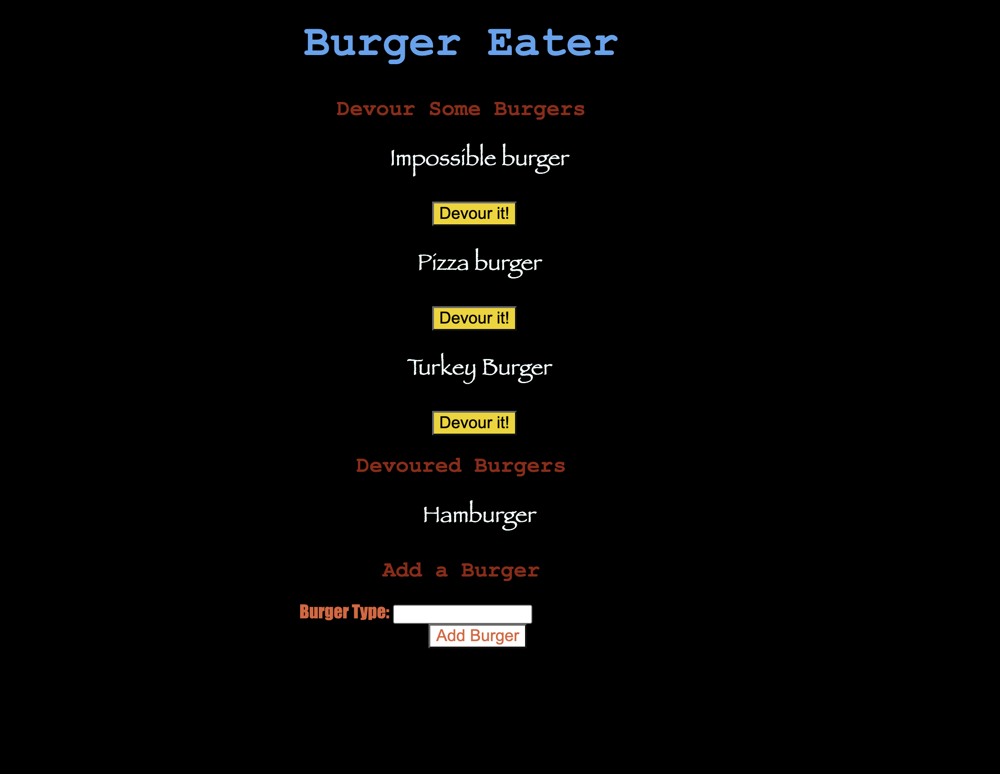

# burgerEater
## Description
  node app with express-handlebars using MVC. 
  ## Table of Contents
  * [License](#license)
  * [Installation](#installation)
  * [Tests](#tests)
  * [Usage](#usage)
  * [Contributing](#contributing)
  * [Questions](#questions)
  ## Installation
  ``` npm install ```
    dotenv
    express
    express-handlebars
    mysql
    JawsDB for mysql for heroku deployment
  ## Tests
  ``` npm test ```
  ## Usage
  NA
  ## License
  MIT
  ## Contributing
  Contact me  
  ## ScreenShot
  